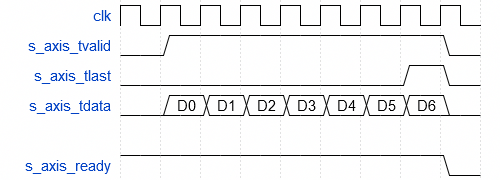
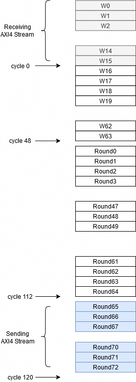
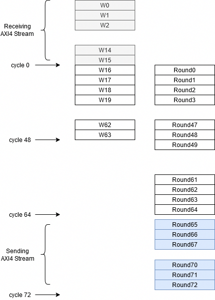
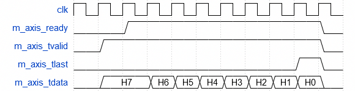

# Core SHA-256

## sha256_core

Module to compute the hash SHA256 of a data vector up to 55 bytes. A hash is a mathematics function that converts any length data into a fixed-length value, generally represented as a data string. It is widely used to verify the integrity of data and in the field of cibersecurity.

### Interface

|Name|Width|Direction|Description|
|-|-|-|-|
|`m_axis_aclk`|32|IN|Clock input|
|`m_axis_aresetn`|32|IN|Reset input|
|`s_axis_tvalid`|32|IN|Slave AXI4 Stream tvalid signal|
|`s_axis_tkeep`|32|IN|Slave AXI4 Stream tkeep signal|
|`s_axis_tready`|32|OUT|Slave AXI4 Stream tready signal|
|`s_axis_tdata`|32|IN|Slave AXI4 Stream tdata signal|
|`s_axis_tlast`|32|IN|Slave AXI4 Stream tlast signal|
|`m_axis_tvalid`|32|OUT|Master AXI4 Stream tvalid signal|
|`m_axis_tkeep`|32|OUT|Master AXI4 Stream tkeep signal|
|`m_axis_tready`|32|IN|Master AXI4 Stream tready signal|
|`m_axis_tdata`|32|OUT|Master AXI4 Stream tdata signal|
|`m_axis_tlast`|32|OUT|Master AXI4 Stream tlast signal|

### How to use this module

#### Sending data

The SHA-256 module features a Slave AXI4 Stream interface to receive the data. This implementation only allows to send up to 55 bytes of data.

Each AXI4 Stream transaction must include one byte of information. The rest of the data will be discarded.

<!-- {reg: [
	{"name": "DATA", "bits": 8},
  	{"bits": '24'},
  
],"config": {"hspace": 600, "bits": 32, "lanes": 2 } 
} -->


When all data is sent, the signal `s_axis_tlast` must be set in order to inform to the module that the data sending is finished, and it will start to calculate the hash.

<!-- {signal: [
  {name: 'clk', wave: 'p........'},
  {name: 's_axis_tvalid', wave: '01......0'},
  {name: 's_axis_tlast', wave:  '0......10'},
  {name: 's_axis_tdata', wave:  '0=======0', data: ['D0','D1','D2','D3','D4','D5','D6']},
  {},
  {name: 's_axis_ready', wave:  '1.......0'},
]} -->




#### Compute SHA256

The calculation of the SHA256 is explained very well in [this](https://sha256algorithm.com/) web page. THE SHA256 can de separate into two different steps, The first step is executen once data is received, and it consists on calculate all the values of the `w` array. The firsts 16 values are filled with the input bytes, followed by 1 `0x80`, and the amount of bytes in the position 15. The rest of the values are calculated following the next equation.

``` verilog
w_array[w_index] <= w_array[w_index-16] + theta0 + w_array[w_index-7] + theta1;
```
Being `theta0` and `theta1`

``` verilog
assign theta0 = {w_array[w_index-15][6:0], w_array[w_index-15][31:7]} ^ {w_array[w_index-15][17:0], w_array[w_index-15][31:18]} ^ {3'b000, w_array[w_index-15][31:3]};
assign theta1 = {w_array[w_index-2][16:0], w_array[w_index-2][31:17]} ^ {w_array[w_index-2][18:0], w_array[w_index-2][31:19]} ^ {10'b0000000000, w_array[w_index-2][31:10]};
```

Once the w matrix is completed, we can jump to the second step. This step is a recursive step where variables a,b,c,d,e,f,g and h will be computed. 

``` verilog
a_reg <= temp1 + temp2;
b_reg <= a_reg; 
c_reg <= b_reg; 
d_reg <= c_reg; 
e_reg <= d_reg + temp1; 
f_reg <= e_reg; 
g_reg <= f_reg; 
h_reg <= g_reg; 
```

Being `temp0` and `temp1`

``` verilog
assign sum0 = {a_reg[1:0], a_reg[31:2]} ^ {a_reg[12:0], a_reg[31:13]} ^ {a_reg[21:0], a_reg [31:22]};
assign sum1 = {e_reg[5:0], e_reg[31:6]} ^ {e_reg[10:0], e_reg[31:11]} ^ {e_reg[24:0], e_reg[31:25]};
assign choice = (e_reg & f_reg) ^ (~e_reg & g_reg);
assign majority = (a_reg & b_reg) ^ (a_reg & c_reg) ^ (b_reg & c_reg);

assign temp1  = h_reg + sum1 + choice + k_round + w_array[round];
assign temp2 = sum0 + majority;
```
When the process is repetead for each value ow `w`, afdter 64 iterations, the value of the hash is stored in the register `hash`.

``` verilog
hash <= {a_reg+h0, b_reg+h1, c_reg+h2, d_reg+h3, e_reg+h4, f_reg+h5, g_reg+h6, h_reg+h7};
```

Extra iterations are needed to send the hash value over AXI4 Stream interface. Notice that the hask calculation is restarted only when a complete read process is executed. If you need to restart the process, an external reset in the module will be needed.

##### Series processing

Due to the natuire of the SHA-256 calculation, the process can ve divided into two different processes, the `w_array` calculation, and the set of iterations. In a computer with only one processor available, these two proceses must be executed in series.

In addition, since each step requires mores than one calculation, each one will take to the processor more than one clock cycle.



##### Parallel processing

because of the design of the FPGA, they can execute parallel processes. In the case of the SHA-256 calculation, once the first 16 values of the `w_matrix` are calculates (the first 16 depend on the input data), since for the first iteration of the second process only needs the first value of the `w_matrix`, the process can start at the same time of the first one, so both processes can be executed at the same time, reducing the amount of cycles needed. In this case, the FPGA can execute for each cycle all the operations needed, so the ampunt of cycles are equal to the clock cycles needed. 

This will be possible as long as the timing constraints are met.



#### Reading HASH

When the hash calculation is complete, `m_axis_tvalid` signal will be set. At this point, when the signal `m_axis_tready` will be set by the host, the hash will be sent in 8 different transactions to complete the 256 bits.

<!-- {signal: [
  {name: 'clk', wave: 'p..........'},
  {name: 'm_axis_ready', wave:  '0.1.......0'},
  {name: 'm_axis_tvalid', wave: '01........0'},
  {name: 'm_axis_tlast', wave:  '0........10'},
  {name: 'm_axis_tdata', wave:  '0=.=======0', data: ['H7','H6','H5','H4','H3','H2','H1','H0']},
]} -->



## Verification

This repository includes a test folder with a simple SHA256 calculation of a 5 byte data array. To launch the test you just need to call the `run.bat` if you are on Windows, or `run.sh` if you are on Linux.

The test uses `iverilog` to simulate the module. In order to be able of executing the sript, `iverilog` must be added to the environment variables or PATH.

## AXI SHA256

### `sha256_core_pif.v`